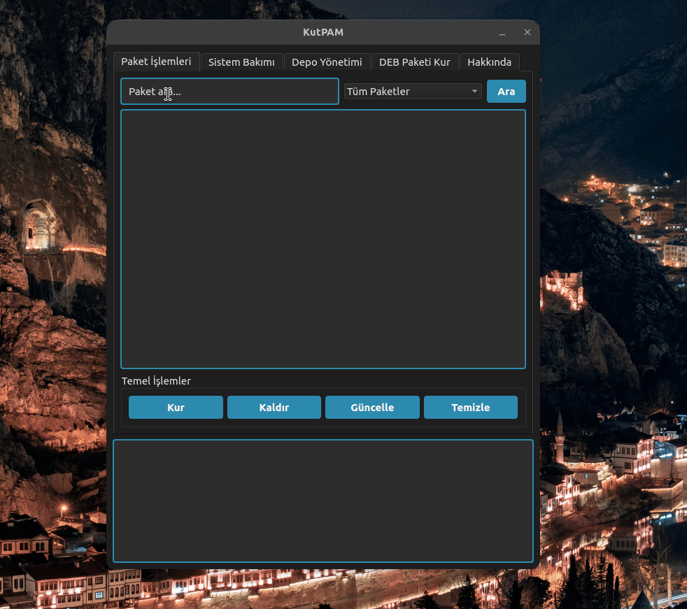

<a href="#">
    
</a>

# KutPAM
KutPAM is a powerful and user-friendly package manager for Linux. It manages APT packages easily while keeping Flatpak applications up to date. Inspired by Gokturk culture, it combines modern functionality with a unique design.


<h1 align="center">KutPAM Logo</h1>

<p align="center">
  
</p>


----------------------

# Linux Screenshot
  

--------------------
Install Git Clone and Python3

Github Package Must Be Installed On Your Device.

git
```bash
sudo apt install git -y
```

Python3
```bash
sudo apt install python3 -y 

```

pip
```bash
sudo apt install python3-pip

```

# Required Libraries

Required Libraries for Debian/Ubuntu
```bash
sudo apt-get install python3-pyqt5
sudo apt-get install qttools5-dev-tools
sudo apt install network-manager
sudo apt install systemd
```


PyQt5
```bash
pip install PyQt5
```
PyQt5-sip
```bash
pip install PyQt5 PyQt5-sip
```

PyQt5-tools
```bash
pip install PyQt5-tools
```

Pillow
```bash
pip install Pillow
```

requests
```bash
pip install requests
```
----------------------------------


# Installation
Install KutPAM

```bash
sudo git clone https://github.com/cektor/KutPAM.git
```
```bash
cd KutPAM
```

```bash
sudo python3 kutpam.py

```

# To compile

NOTE: For Compilation Process pyinstaller must be installed. To Install If Not Installed.

pip install pyinstaller 

Linux Terminal 
```bash
pytohn3 -m pyinstaller --onefile --windowed kutpam.py
```

# To install directly on Linux

Linux (based debian) Terminal: Linux (debian based distributions) To install directly from Terminal.
```bash
wget -O Setup_Linux64.deb https://github.com/cektor/KutPAM/releases/download/1.00/Setup_Linux64.deb && sudo apt install ./Setup_Linux64.deb && sudo apt-get install -f -y
```


Release Page: https://github.com/cektor/KutPAM/releases/tag/1.00

----------------------------------
